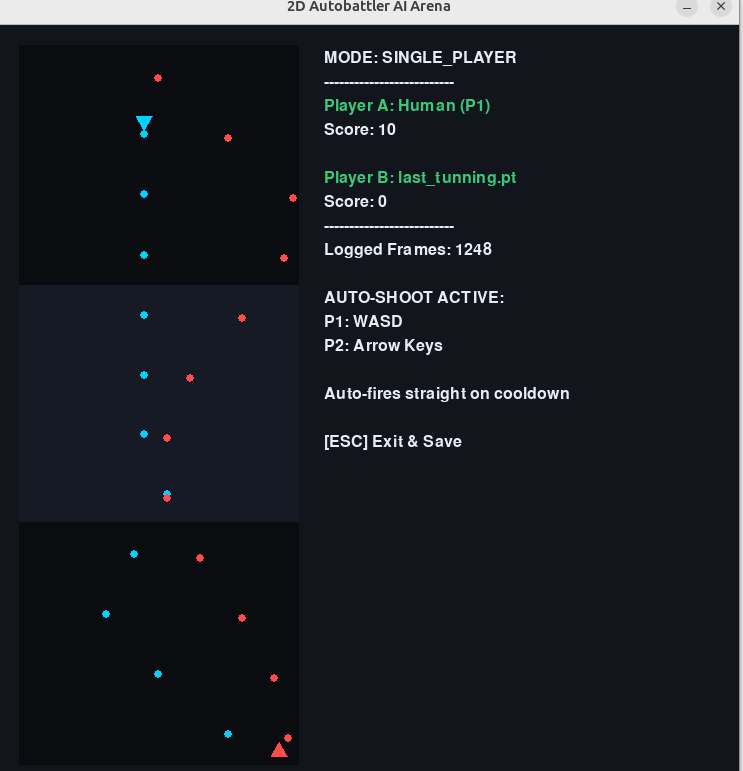
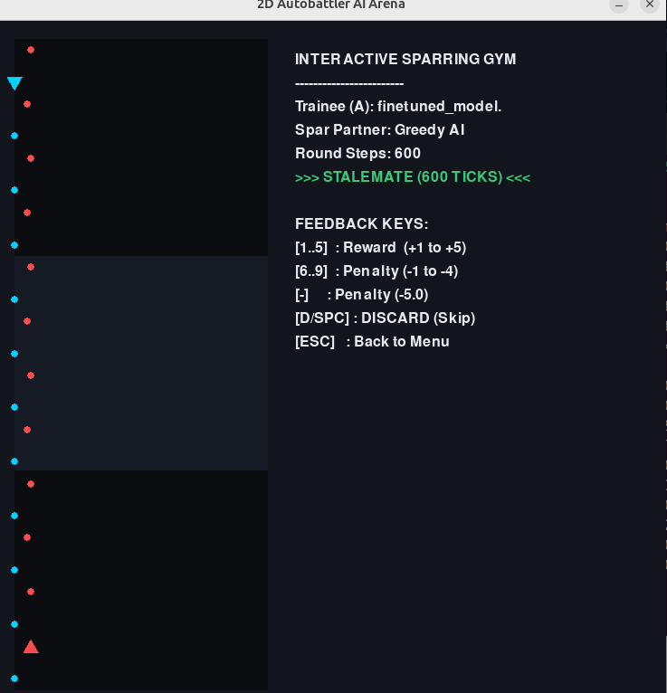

# 2D Autobattler AI Arena: Train Your Personal AI Clone

This project allows anyone—without any coding or AI background—to train, coach, and battle artificial intelligence agents like digital pets.

## 1. Why This Project Exists

1. Train an AI Like a Pet: Most modern AI models are trained on massive server clusters. Here, you train your bot locally on your own computer using two natural methods: Imitation (the bot copies your moves) and Interactive Coaching (you give it praise or penalties).
2. Understand Machine Learning Visually: See in real time how settings like curiosity (exploration), memory length, and human bias directly shape an agent's intelligence on screen.
3. Clash of Clones: Pit your trained bot against rule-based computer opponents, against your friends' custom bots, or against earlier versions of itself to see whose playstyle wins.

## 2. Game Rules & Mechanics

The game takes place on a vertical court (50 columns wide by 300 rows long):
* Player A (Cyan Triangle, Top) faces Player B (Red Triangle, Bottom) across a middle dead zone.
* Auto-Shooting: Both players automatically fire bullets straight forward on cooldown (every 0.5s).
* Movement is Strategy: You do not need a shoot button. By moving horizontally and vertically, you simultaneously dodge enemy bullets and place vertical streams of fire to trap your opponent.

## 3. Installation & Getting Started

### Windows ( No Terminal Required to Play!)

1. Download and install Python from https://www.python.org/downloads/ (version 3.10, 3.11, or 3.12).
   CRITICAL STEP: On the very first setup screen, check the box that says:
   [X] Add python.exe to PATH
   Then click Install Now.

2. Install the required libraries:
   * Open your game folder in Windows File Explorer.
   * Click the folder path bar at the top, type cmd, and press Enter. Or right-click and select Open Terminal.
   * In the black window, type:
     pip install -r requirements.txt
   * Press Enter and close the window once it finishes.

3. Play:
   * You can now simply double-click main.py in File Explorer to start the game!

### Linux (Ubuntu / Debian)

Ubuntu 23.04+ enforces virtual environments. Run these standard commands in your terminal:

1. Create and activate a clean virtual environment:
   python3 -m venv venv
   source venv/bin/activate

2. Install dependencies:
   pip install -r requirements.txt

3. Launch the game:
   python3 main.py

### macOS

1. Install Python 3 from https://www.python.org/ or via Homebrew (brew install python).
2. Open Terminal in the project folder and run:
   pip3 install -r requirements.txt
3. Start the game by running:
   python3 main.py
   (You can also right-click main.py -> Open With -> Python Launcher).

### Model file safety

Use an up-to-date PyTorch release and upgrade existing installations with
`python -m pip install --upgrade -r requirements.txt`.
PyTorch 2.10.0 is the minimum because it fixes a model-loading vulnerability
([CVE-2026-24747](https://github.com/pytorch/pytorch/security/advisories/GHSA-63cw-57p8-fm3p)).

The game loads model weights with `weights_only=True` on the CPU. Only load
`.pt` files from sources you trust: restricted loading reduces risk but does
not make arbitrary model files safe. If a file fails restricted loading, do
not bypass the error with `weights_only=False` or allowlist unknown functions.
You can play against Greedy AI or another human without loading model files.

To run the regression tests after installing the dependencies:
`python -m unittest discover -s tests -v`.

## 4. Game Modes

* Mode 1: Real Game (Agent vs Agent): Watch two trained neural networks battle autonomously. Select models from the file browser.
* Mode 2: Single Player (Human vs AI): Play as Player 1 against the computer. Every move you make is automatically recorded to recordings/ as training data.
* Mode 3: Multiplayer (Human vs Human): Play against a friend locally (P1: WASD, P2: Arrow keys). Logs competitive human dueling data.
* Mode 4: Offline Imitation Training: Automatically trains a new neural model from your logged matches with built-in reflection symmetry.
* Mode 5: Interactive Sparring Gym: Live coaching mode. Watch your model spar against Greedy AI or another bot. Press SPACE anytime to pause, then press 1..5 to reward a good move or - to penalize a bad move.
* Mode 6: Options / Hyperparameters: Interactive menu to adjust learning settings.

## 5. Parameter Guide for Beginners

Adjust these in Option 6 using the arrow keys:

* Imitation Epochs (Default: 30): How many times the bot studies your gameplay logs. Higher values (60-100) help it memorize your dodging style deeper.
* Imitation Learning Rate (Default: 0.001): How aggressively the bot updates its brain when studying your games.
* Exploration Rate % (Default: 20%): How often the agent takes a random action instead of following its habit. Essential for breaking out of corners.
* RL Fine-Tuning LR (Default: 0.002): How strongly your live coaching praise (+5) shifts the bot's decisions.
* Discount Factor Gamma (Default: 0.96): Memory horizon. Connects a move made now to a hit scored 2 seconds later.

## 6. Recommended Training Walkthrough

1. Step 1: Spar Against the Model Zoo:
   Go to Single Player and pick an opponent from the included models:
   * saved_models/last_imitation.pt (Trained by copying human play).
   * saved_models/last_tunning.pt (Refined through interactive sparring).
   * Or test yourself against the rule-based Greedy AI.

2. Step 2: Create Your Clone:
   Play Single Player for 2 to 3 minutes. Move actively, weave through bullets, and score 10-15 hits. Press ESC to save.
   Select Option 4 (Offline Imitation Training). Within seconds, your new clone is saved to saved_models/!

3. Step 3: Test Your Clone:
   Open Mode 1 (Agent vs Agent), load your clone into Slot A and Greedy AI into Slot B, and watch your clone play!

## 7. The Camping Stalemate & How to Solve It

During continuous matches, both bots may retreat to opposite side walls and shoot parallel lines, creating a deadlock.

Why it happens: When shooting straight, lane X=0 and lane X=40 never collide. Because no bullets cross their path, both bots feel 100% safe and have no reason to move.

How to break it:
* Solution A (Imitation): Play Single Player against the camper. Use the Jiggle-Peek tactic (wait in safety, step in right as your gun fires, and step back). Record 2 minutes of this and run Imitation Training. The clone learns how to snipe campers!
* Solution B (Curiosity): In Options, set Exploration Rate to more than 50%. In the Sparring Gym, the bot will occasionally take a random step away from the wall. The moment it steps toward the center, press SPACE and press 5 to reward it!
* Find your own solutions :)

Write to me if you need any support or simply want a match for your trained pets:

[Linkedin](https://www.linkedin.com/in/s%C6%A1n-l%C3%AA-24a593176/)

[Email](officialquangsonle@gmail.com)
